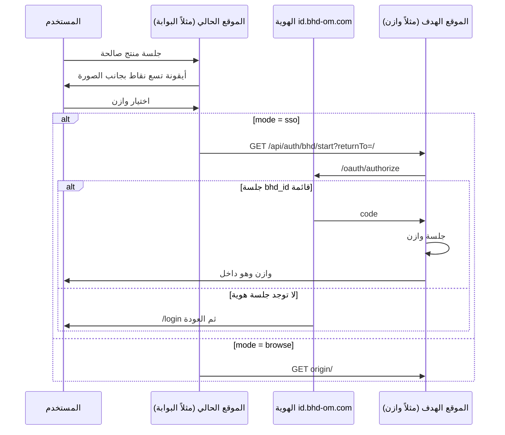

# مواصفة مشغّل تطبيقات BHD (BHD App Switcher)

> **الحالة:** معتمدة للتنفيذ كما هي — لا تُحرَّف محلياً في كل مستودع.  
> **المصدر الوحيد:** هذا الملف في [ainoamn/ONE-BHD](https://github.com/ainoamn/ONE-BHD) — `docs/BHD-APP-SWITCHER.md`  
> **التاريخ:** 18 أغسطس 2026  
> **الإصدار:** `bhd-appswitcher.v1`  
> **يعتمد على:** [`BHD-IDENTITY-SSO.md`](BHD-IDENTITY-SSO.md) الإصدار `bhd-identity.v1`  
> **الناشر:** بوابة BHD — مشروع Vercel `one-bhd`

انسخ هذا الملف إلى مستودع المنتج تحت `docs/BHD-APP-SWITCHER.md` دون تعديل القيم المجمّدة. انسخ أيضاً الكتالوج المجمد في القسم 4 إلى `lib/bhd/apps.ts` **حرفياً**. لا تضف تطبيقاً محلياً، ولا تحذف تطبيقاً، ولا تغيّر رابط النقر.

---

## 0. عقد التنفيذ (للوكيل والمطوّر)

1. المشغّل يظهر **فقط بعد وجود جلسة منتج صالحة** (المستخدم مسجّل في هذا الموقع). بلا جلسة: لا شبكة تطبيقات ولا أيقونة تسع نقاط بجانب الحساب.
2. موضع المشغّل ثابت: **يسار أيقونة المستخدم في الواجهة العربية (RTL)**، ملاصق لها في شريط الرأس. لا يُوضع في التذييل ولا في القائمة الجانبية ولا في صفحة مستقلة.
3. النقر على تطبيق **آخر** لا يفتح `iframe` ولا نافذة منبثقة ولا يشارك كوكي. ينتقل المتصفح انتقالاً كاملاً (`window.location.assign`).
4. إن كان للتطبيق `mode: "sso"` فالنقر يذهب إلى `{origin}/api/auth/bhd/start?returnTo=/` وليس إلى أصل الموقع وحده. هذا يعيد استخدام جلسة الهوية على `id.bhd-om.com` دون طلب كلمة مرور إن كانت قائمة.
5. إن كان `mode: "browse"` فالنقر يذهب إلى `origin` فقط (الموقع لم يُكمل بعد قسم 6 من SSO). لا تخترع مساراً محلياً بديلاً.
6. **لا تضبط** `Domain=.bhd-om.com` على أي كوكي. الجلسات تبقى Host-only كما في مواصفة الهوية.
7. **لا تجلب** قائمة التطبيقات من شبكة خارجية في v1. المصدر هو الملف المجمد في القسم 4. تحديث القائمة يتم في ONE-BHD ثم يُنسخ الملف.
8. **لا تُظهر** لوحة `/admin` داخل المشغّل. الإدارة صلاحية منصة على الهوية فقط.
9. **لا تُظهر** زر Google داخل المشغّل. جوجل على نطاق الهوية فقط.
10. إن تعارض هذا الملف مع مشغّل تسويقي قديم في الموقع، هذا الملف هو المرجع لشريط الحساب بعد الدخول. المشغّل التسويقي للزائر غير المسجّل يبقى اختياريًا في البوابة العامة فقط، ومنفصل المكوّن والاسم.

---

## 1. الهدف

بعد تسجيل الدخول الموحّد، يرى المستخدم بجانب صورته شبكة تطبيقات مجموعة بن حمود (سلوك تطبيقات Google: أيقونة تسع نقاط → بطاقة → شبكة 3 أعمدة). ينتقل بين البوابة ووازن وحسابي ونَسَب وبيتك والمتجر دون أن يبحث عن الروابط.



---

## 2. قيم مجمّدة — لا تغيّرها

| المفتاح | القيمة |
|---|---|
| مواصفة المشغّل | `bhd-appswitcher.v1` |
| اسم المكوّن | `BhdAppSwitcher` |
| مسار المكوّن | `components/bhd/BhdAppSwitcher.tsx` |
| مسار الكتالوج | `lib/bhd/apps.ts` |
| مسار الشعار | `components/bhd/BhdAppIcon.tsx` |
| بادئة CSS | `bhd-switcher-` |
| اتجاه الواجهة | `dir="rtl"` للعربية |
| أعمدة الشبكة | 3 |
| أقصى ارتفاع للبطاقة | 360px مع تمرير داخلي |
| عرض البطاقة | 320px (على الجوال: عرض الشاشة ناقص 24px) |
| حجم هدف اللمس | 44×44px للأيقونة وللعنصر |
| `z-index` البطاقة | 80 |
| إغلاق | Escape + نقرة خارج البطاقة + اختيار عنصر |

### 2.1 ترتيب شريط الحساب (بعد الدخول فقط)

من جهة `inline-end` للرأس في RTL، العناصر بهذا الترتيب البصري من اليمين إلى اليسار:

1. أيقونة تسع النقاط (`bhd-switcher-grid`) — `aria-label="تطبيقات BHD"`
2. زر الحساب (صورة أو الحرف الأول) — يفتح بطاقة الحساب
3. لا اسم طويل في الشريط على الشاشات أقل من 720px

لا تضع زر «خروج» عارياً بجانب الصورة. الخروج من بطاقة الحساب فقط.

### 2.2 بطاقة الحساب (من زر الصورة)

| الحقل | المصدر |
|---|---|
| الصورة | جلسة المنتج (`picture`) وإلا الحرف الأول من `name` |
| الاسم | جلسة المنتج |
| البريد | جلسة المنتج |
| رابط «الحساب» | على البوابة/الهوية: `/account`. على بقية المنتجات: `https://id.bhd-om.com/account` |
| خروج | `POST` مسار الخروج الحالي للمنتج ثم تحويل إلى `{ISSUER}/oauth/end-session` كما في قسم 6.5 من SSO |

---

## 3. قواعد النقر — إلزامية

لكل عنصر في الكتالوج:

| الحالة | السلوك |
|---|---|
| `id` يساوي موقعك الحالي (`current`) | أغلق البطاقة. لا تنقل. إلا «الحساب»: افتح `/account` إن لم تكن عليها |
| `enabled: false` | العنصر ظاهر باهتًا، `aria-disabled="true"`، لا نقر |
| `mode: "sso"` | `window.location.assign(app.startUrl)` |
| `mode: "browse"` | `window.location.assign(app.origin + "/")` |
| `mode: "identity"` | `window.location.assign` لصفحة الحساب (`/account` على البوابة، وإلا `https://id.bhd-om.com/account`) |

`startUrl` ثابت:

```
{origin}/api/auth/bhd/start?returnTo=/
```

`returnTo` دائماً `/` من المشغّل. لا تمرّر عنوان الصفحة الحالية إلى موقع آخر (منع تسريب مسارات داخلية).

لا تستخدم `target="_blank"` في المشغّل بعد الدخول.

---

## 4. الكتالوج المجمد (`lib/bhd/apps.ts`)

انسخ هذا الملف كما هو. `current` يُحسب في المكوّن بمقارنة `window.location.origin` مع `origin` بعد إزالة الشرطة النهائية.

```ts
export type BhdAppMode = "identity" | "sso" | "browse";

export type BhdApp = {
  id: string;
  clientId: string | null;
  nameAr: string;
  nameEn: string;
  origin: string;
  startUrl: string | null;
  mode: BhdAppMode;
  enabled: boolean;
  mark: string;
  accent: string;
  soft: string;
};

export const BHD_APP_SWITCHER_SPEC = "bhd-appswitcher.v1";

export const BHD_APPS: BhdApp[] = [
  {
    id: "account",
    clientId: null,
    nameAr: "الحساب",
    nameEn: "Account",
    origin: "https://id.bhd-om.com",
    startUrl: null,
    mode: "identity",
    enabled: true,
    mark: "حـ",
    accent: "#092d24",
    soft: "#e8f4f1",
  },
  {
    id: "portal",
    clientId: "bhd-portal",
    nameAr: "البوابة",
    nameEn: "Portal",
    origin: "https://www.bhd-om.com",
    startUrl: "https://www.bhd-om.com/api/auth/bhd/start?returnTo=/",
    mode: "sso",
    enabled: true,
    mark: "B",
    accent: "#075c45",
    soft: "#e6f1ec",
  },
  {
    id: "wazen",
    clientId: "bhd-wazen",
    nameAr: "وازن",
    nameEn: "WAZEN",
    origin: "https://wazen.bhd-om.com",
    startUrl: "https://wazen.bhd-om.com/api/auth/bhd/start?returnTo=/",
    mode: "browse",
    enabled: true,
    mark: "و",
    accent: "#126b63",
    soft: "#e8f4f1",
  },
  {
    id: "hisaby",
    clientId: "bhd-hisaby",
    nameAr: "حسابي",
    nameEn: "HISAB",
    origin: "https://hisaby.bhd-om.com",
    startUrl: "https://hisaby.bhd-om.com/api/auth/bhd/start?returnTo=/",
    mode: "browse",
    enabled: true,
    mark: "ح",
    accent: "#075c45",
    soft: "#e6f1ec",
  },
  {
    id: "nasab",
    clientId: "bhd-nasab",
    nameAr: "نَسَب",
    nameEn: "NASAB",
    origin: "https://nasab.bhd-om.com",
    startUrl: "https://nasab.bhd-om.com/api/auth/bhd/start?returnTo=/",
    mode: "sso",
    enabled: true,
    mark: "ن",
    accent: "#8a3c45",
    soft: "#f6e9eb",
  },
  {
    id: "baitak",
    clientId: "bhd-baitak",
    nameAr: "بيتك",
    nameEn: "BAITAK",
    origin: "https://baitak.bhd-om.com",
    startUrl: "https://baitak.bhd-om.com/api/auth/bhd/start?returnTo=/",
    mode: "browse",
    enabled: true,
    mark: "ب",
    accent: "#a66b2d",
    soft: "#f8efe4",
  },
  {
    id: "store",
    clientId: "bhd-store",
    nameAr: "المتجر",
    nameEn: "BHD Store",
    origin: "https://bhdstor.bhd-om.com",
    startUrl: "https://bhdstor.bhd-om.com/api/auth/bhd/start?returnTo=/",
    mode: "sso",
    enabled: true,
    mark: "م",
    accent: "#315d89",
    soft: "#e9f0f7",
  },
  {
    id: "office",
    clientId: "bhd-office",
    nameAr: "المكتب",
    nameEn: "BHD Office",
    origin: "",
    startUrl: null,
    mode: "browse",
    enabled: false,
    mark: "B",
    accent: "#283b4d",
    soft: "#e9edf0",
  },
];
```

عندما يُكمل منتج قسم 6 من SSO، **لا يعدّل المنتج ملفه**. يُغيَّر `mode` من `"browse"` إلى `"sso"` هنا في ONE-BHD ثم يُنسخ `apps.ts` إلى الجميع.

`hisaby.pro` ليس عنصرًا في المشغّل. العنصر الرسمي حسابي هو `hisaby.bhd-om.com`.

---

## 5. الشكل (مطابقة سلوك Google لا نسخ علامته)

البطاقة بيضاء، زوايا 16px، حد `#d7e2dc`، خلفية الصفحة لا تُعتم بطبقة سوداء كاملة (لا modal معتم). ظل خفيف مسموح: `0 18px 40px rgba(9, 45, 36, 0.12)`.

رأس البطاقة:

- يمين: «تطبيقات BHD»
- يسار: لا قلم تخصيص في v1 (لا تفضيلات محلية حتى لا تختلف المواقع)

كل خلية:

- مربع مستدير 48px (`BhdAppIcon`) بشعار التطبيق ولون `soft`/`accent`
- الحرف `mark` احتياطي فقط إن لم يُنسخ مكوّن الشعار
- اسم عربي تحت الأيقونة، سطر واحد
- الموقع الحالي: حلقة 2px بلون `accent` حول الشعار و`aria-current="page"`

أيقونة التسع نقاط: 3×3 مربعات 4px، فجوة 3px، لون `#092d24`. ليست شعار Google.

لا تستخدم شعارات Google ولا كلمة Google في الواجهة.

---

## 6. الوصول ولوحة المفاتيح

- الزر: `aria-haspopup="dialog"` و`aria-expanded`
- البطاقة: `role="dialog"` و`aria-label="تطبيقات BHD"`
- الخلايا: أزرار أو روابط في ترتيب الشبكة (يمين→يسار، أعلى→أسفل)
- Tab يدور داخل البطاقة المفتوحة
- Escape يغلق ويعيد التركيز إلى زر التسع نقاط
- على عرض أقل من 600px: البطاقة `position: fixed` تحت الرأس، العرض `calc(100vw - 24px)`

---

## 7. الأمان

- انتقال أعلى الوثيقة فقط. `X-Frame-Options: DENY` يبقى. لا تضمين مواقع أخرى.
- لا `postMessage` بين الأصول.
- لا قراءة كوكي موقع آخر.
- CSP: لا حاجة لـ `connect-src` إضافي في v1 (لا fetch للكتالوج).
- `startUrl` و`origin` من الملف المجمد فقط. ارفض أي رابط يأتي من query أو localStorage.
- لا تخزّن ترتيبًا مخصصًا في `localStorage` في v1 (يمنع اختلاف التجربة بين الأجهزة والمواقع).

---

## 8. الربط مع الهوية

المشغّل **لا يغني** عن SSO. هو واجهة تنقّل فوقه.

| قبل إطلاق المشغّل في منتج | المطلوب |
|---|---|
| جلسة منتج بعد OIDC | قسم 6 من `BHD-IDENTITY-SSO.md` |
| مسار البدء | `GET /api/auth/bhd/start` |
| مسار النداء | `GET /api/auth/bhd/callback` |
| الخروج | قسم 6.5 (مسح جلسة المنتج ثم `end-session`) |

على البوابة اليوم `mode: "sso"` لأن مسار البدء موجود. بقية المنتجات تبقى `"browse"` حتى يُنفَّذ القسم 6 ثم يُحدَّث الكتالوج هنا.

---

## 9. أين يُركَّب المكوّن

في **كل** صفحة مصادَق عليها التي تعرض رأس الحساب:

```tsx
<div className="bhd-switcher-slot">
  <BhdAppSwitcher
    user={{ name, email, picture }}
    onSignOut={signOut}
  />
</div>
```

`signOut` يستدعي مسار خروج **هذا** المنتج ثم تحويل الهوية. لا تجعل المشغّل يستدعي خروج المواقع الأخرى.

صفحات التسويق العامة بلا جلسة: لا مشغّل حساب. البوابة يجوز أن تبقي مشغّلها التسويقي القديم للزائر تحت اسم مختلف (`PublicProductLauncher`) بلا تسع نقاط بجانب صورة مستخدم غير موجودة.

---

## 10. اختبار إلزامي قبل القطع

1. بلا جلسة: لا أيقونة تسع نقاط بجانب مكان الحساب.
2. بعد الدخول: الأيقونة ملاصقة للصورة.
3. فتح الشبكة يظهر العناصر بنفس الترتيب في القسم 4.
4. العنصر الحالي معلّم ولا ينقل.
5. «المكتب» باهت ولا ينقر.
6. Escape والنقرة خارج البطاقة يغلقانها.
7. من البوابة، «الحساب» يفتح `/account` (أو `https://id.bhd-om.com/account` من منتج آخر).
8. من البوابة، «البوابة» يغلق البطاقة فقط.
9. بعد أن يصبح وازن `mode: "sso"`: النقر من البوابة يصل وازن داخلًا دون نموذج كلمة مرور إن جلسة `bhd_id` قائمة.
10. الخروج من بطاقة الحساب يمسح جلسة المنتج ثم يطلب دخولًا جديدًا على ذلك المنتج.
11. الشبكة متطابقة في موقعين بعد نسخ `apps.ts` (لا تطبيق إضافي محلي).

---

## 11. مراحل التنفيذ (ترتيب ملزم)

| المرحلة | أين | تعريف «تم» |
|---|---|---|
| **A** | ONE-BHD | هذه المواصفة في `docs/` ونسخ البوابة |
| **B** | بوابة `v1.1.0` | `BhdAppSwitcher` يعمل بعد الدخول على `www` و`id` |
| **C** | كل منتج بعد قسم 6 SSO | نسخ المكوّن + `apps.ts` كما هما في شريط الحساب |
| **D** | ONE-BHD | قلب `mode` إلى `"sso"` لذلك المنتج ثم إعادة نسخ `apps.ts` |

لا تبدأ C في منتج قبل نجاح دخول OIDC فيه. لا تبدأ D قبل أن يرد `GET {origin}/api/auth/bhd/start` بتحويل 302 إلى الهوية.

---

## 12. ما يُحظر (أخطاء شائعة)

- نسخ قائمة المنتجات من `products.ts` المحلية بدل `apps.ts` المجمد (تختلف الأسماء والروابط).
- فتح التطبيق في تبويب جديد.
- وضع المشغّل للزائر غير المسجّل بجانب أيقونة مستخدم وهمية.
- استخدام `Domain=.bhd-om.com` «لتسهيل» التنقل.
- إضافة تفضيلات سحب-وإفلات في v1.
- إظهار تطبيقات معطّلة كأنها تعمل.
- تغيير `returnTo` إلى مسار لوحة تحكم داخلية لموقع آخر.

---

## 13. رسالة لصق في المستودعات الأخرى

```text
المصدر المعتمد: https://github.com/ainoamn/ONE-BHD/blob/main/docs/BHD-APP-SWITCHER.md
الإصدار: bhd-appswitcher.v1
يعتمد على: docs/BHD-IDENTITY-SSO.md (bhd-identity.v1)
انسخ docs/BHD-APP-SWITCHER.md وlib/bhd/apps.ts كما هما.
المكوّن: components/bhd/BhdAppSwitcher.tsx وBhdAppIcon.tsx بجانب أيقونة المستخدم بعد الجلسة فقط.
لا تحرّف الكتالوج محلياً.
```
