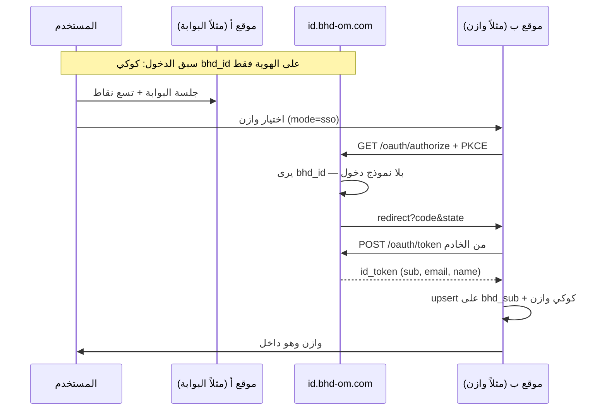

# الدليل المرجعي — الدخول الموحّد ومشغّل تطبيقات BHD

> **الحالة:** مرجع تشغيلي معتمد لكل المواقع الحالية والمستقبلية. 
> **المصدر الوحيد:** هذا الملف في [ainoamn/ONE-BHD](https://github.com/ainoamn/ONE-BHD) — `docs/BHD-UNIFIED-LOGIN-AND-APPS.md` 
> **التاريخ:** 19 أغسطس 2026 
> **الإصدار:** `bhd-unified-login-apps.v1` 
> **المواصفات البروتوكولية (لا تُحرَّف):** 
> - [`BHD-IDENTITY-SSO.md`](BHD-IDENTITY-SSO.md) — `bhd-identity.v1` 
> - [`BHD-APP-SWITCHER.md`](BHD-APP-SWITCHER.md) — `bhd-appswitcher.v1` 
> **الناشر:** بوابة BHD — مشروع Vercel `one-bhd` — المُصدِر `https://id.bhd-om.com`

انسخ هذا الملف إلى مستودع كل منتج تحت `docs/BHD-UNIFIED-LOGIN-AND-APPS.md`. بعد تثبيت الدخول والمشغّل **املأ القسم 12 الخاص بموقعك**: كيف ثبّتت، كيف يعمل، والتقنيات الكاملة لبناء ذلك الموقع. لا تحذف أقسام المواقع الأخرى.

---

## 0. ماذا يوحَّد وماذا يبقى محلياً

| يوحَّد على الهوية | يبقى داخل كل منتج |
|---|---|
| إنشاء الحساب (بريد / اسم مستخدم / Google) | الفواتير والاشتراكات التشغيلية |
| شاشة الدخول `/login` | المحافظ، الكاشير، الشجرة، العقارات، الطلبات |
| صفحة الملف `/account` | الأدوار والصلاحيات داخل التطبيق |
| مشغّل التطبيقات (تسع نقاط) | قاعدة بيانات المنتج ونشره |
| معرّف المستخدم `sub` | جلسة المنتج على نطاقه فقط |

المستخدم يدخل مرة على الهوية. بعد ذلك التنقل بين المواقع **لا يعيد نموذج كلمة المرور** إن كانت جلسة الهوية قائمة. النظام يثبت الحساب في الموقع الجديد بربط `bhd_sub` دون إنشاء كلمة مرور ثانية.

---

## 1. لماذا يعمل التنقل دون إعادة تسجيل (بدون مخاطرة)

الكوكي **لا يُشارك** عبر النطاقات. لا `Domain=.bhd-om.com`. لا `iframe`. لا قاعدة بيانات مشتركة.

ما يحدث فعلياً:

1. عند أول دخول ناجح على `id.bhd-om.com` تُضبط كوكي هوية اسمها `bhd_id`، **Host-only** على مضيف الهوية فقط، مدة 7 أيام، `HttpOnly` + `Secure` + `SameSite=Lax`.
2. عندما يفتح المستخدم منتجاً آخر (مثلاً وازن) يذهب المتصفح إلى `{origin}/api/auth/bhd/start` ثم إلى 
 `https://id.bhd-om.com/oauth/authorize?...`
3. الهوية ترى كوكي `bhd_id` لأنها على **نفس المضيف** الذي ضبطها. لا تحتاج كلمة مرور.
4. تصدر كود تفويض لمرة واحدة (60 ثانية) وترجع المنتج إلى `/api/auth/bhd/callback`.
5. خادم المنتج يستبدل الكود بتوكن على `POST /oauth/token`، يتحقق من `id_token`، يربط أو ينشئ مستخدمه المحلي بـ `bhd_sub = sub`، ثم يضبط **كوكي جلسة ذلك المنتج** على نطاقه وحده.

لذلك: الدخول السابق إلى **أي** موقع يمر عبر الهوية يكفي للتنقل اللاحق. الموقع الجديد لا يقرأ كوكي الموقع القديم؛ يثق بتوكن صادر من الهوية بعد PKCE.

إن لم تكن جلسة `bhd_id` قائمة (خروج موحّد، أو متصفح آخر، أو انتهاء 7 أيام) تظهر شاشة `/login` مرة واحدة ثم يعود المنتج.



---

## 2. قيم مجمّدة — لا تغيّرها في أي مستودع

| المفتاح | القيمة |
|---|---|
| مواصفة الهوية | `bhd-identity.v1` |
| مواصفة المشغّل | `bhd-appswitcher.v1` |
| Issuer | `https://id.bhd-om.com` |
| اكتشاف OIDC | `https://id.bhd-om.com/.well-known/openid-configuration` |
| شاشة الدخول | `https://id.bhd-om.com/login` |
| صفحة الحساب | `https://id.bhd-om.com/account` |
| لوحة المنصة | `https://id.bhd-om.com/admin` |
| مشروع Vercel للهوية | `one-bhd` — Root Directory: `BHD-Complete-Brand-and-Portal-v1.1.0` |
| مستودع الهوية | `ainoamn/ONE-BHD` |
| Neon | مشروع `bhd-identity` — جداول الهوية فقط |
| PKCE | `S256` إلزامي |
| scopes | `openid profile email` |
| صلاحية الكود | 60 ثانية، استخدام واحد |
| صلاحية ID/Access Token | 10 دقائق |
| صلاحية Refresh | 30 يوماً مع تدوير |
| صلاحية `bhd_id` | 7 أيام |
| DNS للنطاقات الفرعية | CNAME → `cname.vercel-dns.com` (**ليس** `vercel-dns-017`) |

### 2.1 `client_id` و`redirect_uri` الإنتاج

| المنتج | `client_id` | الأصل | callback الإنتاج |
|---|---|---|---|
| البوابة | `bhd-portal` | `https://www.bhd-om.com` | `https://www.bhd-om.com/api/auth/bhd/callback` |
| وازن | `bhd-wazen` | `https://wazen.bhd-om.com` | `https://wazen.bhd-om.com/api/auth/bhd/callback` |
| حسابي | `bhd-hisaby` | `https://hisaby.bhd-om.com` | `https://hisaby.bhd-om.com/api/auth/bhd/callback` |
| نَسَب | `bhd-nasab` | `https://nasab.bhd-om.com` | `https://nasab.bhd-om.com/api/auth/bhd/callback` |
| المتجر | `bhd-store` | `https://bhdstor.bhd-om.com` | `https://bhdstor.bhd-om.com/api/auth/bhd/callback` |
| بيتك | `bhd-baitak` | `https://baitak.bhd-om.com` | `https://baitak.bhd-om.com/api/auth/bhd/callback` |
| المكتب | `bhd-office` | داخلي | `{origin}/api/auth/bhd/callback` |

محلياً يُسمح أيضاً بـ `http://localhost:3000/api/auth/bhd/callback` (وازن أيضاً `:3001`). المقارنة **مطابقة تامة**.

`hisaby.pro` نطاق إضافي لحسابي وليس عنصراً في المشغّل. `bhd-ain-oman` يُعامل كاسم قديم لـ `bhd-baitak` إن وُجد في حل العميل.

### 2.2 كوكيز — أسماء ثابتة

| الاسم | أين | Domain | الغرض |
|---|---|---|---|
| `bhd_id` | الهوية فقط | Host-only | جلسة مزوّد الهوية |
| `bhd_portal` | البوابة (نفس التطبيق) | Host-only | جلسة البوابة؛ تُضبط مع `bhd_id` على هذا المضيف |
| `bhd_oauth_state` | المنتج، 5 دقائق | Host-only | `state` + `nonce` + `code_verifier` أثناء التحويل |
| جلسة المنتج | ذلك المنتج | Host-only | اسم الكوكي الحالي للمنتج (لا تستخدم `bhd_id`) |

ممنوع: `Domain=.bhd-om.com`. SSO يعمل لأن التحويل يصل إلى مضيف الهوية فيرى كوكيه.

### 2.3 مطالبات ID Token

إلزامي: `iss`, `aud`, `sub`, `exp`, `iat`, `nonce`, `email`, `email_verified` 
اختياري: `name`, `picture`, `preferred_username`, `phone_number`

التحقق على **خادم المنتج**: `iss` === Issuer، `aud` === `client_id` الخاص به، `nonce` يطابق الكوكي، `email_verified === true`. رفض توكن `aud` لمنتج آخر.

---

## 3. بناء شاشة الدخول الموحّدة (الموقع الرئيسي)

هذه الشاشة **واحدة** لكل المنظومة. المنتجات لا تبني نموذجاً موازياً بعد الربط؛ `/login` عندهم غلاف يحوّل إلى `/api/auth/bhd/start`.

### 3.1 العنوان والسلوك

- المسار: `https://id.bhd-om.com/login` (ونفس التطبيق على `www.bhd-om.com/login` لأنهما مشروع واحد؛ الكوكي Host-only فادخل من المضيف الذي ستستخدمه).
- `noindex, noarchive` و`Cache-Control: private, no-store`.
- إن وُجد `?next=` وكان مساراً آمناً يبدأ بـ `/` يُعاد إليه بعد النجاح. مسار التفويض يُمرَّر هكذا: `/login?next=/oauth/authorize?...` حتى يعود المستخدم لإكمال SSO دون إعادة كتابة المعامل.

### 3.2 ماذا تعرض الشاشة

1. شعار BHD الرسمي ووعد **ابنِ أحلامًا أكبر**.
2. دخول بالبريد أو اسم مستخدم + كلمة المرور (`POST /api/auth/login`).
3. إنشاء حساب (`POST /api/auth/register`) مع دفتر عنوان SELF اختياري (هاتف، مدينة…).
4. زر Google **على هذه الشاشة فقط** — GIS / `POST /api/auth/google` يتحقق من ID Token على الخادم بـ `google-auth-library`.
5. لا زر Google على وازن أو حسابي بعد القطع.

كلمة المرور في الهوية: `bcryptjs` rounds `12`. القفل بعد 5 محاولات فاشلة لمدة 15 دقيقة.

عميل Google العام (آمن في الواجهة):

`162957418455-d734efb8n4oe0ba5e664583a255ks50t.apps.googleusercontent.com`

### 3.3 نقاط نهاية الهوية التي تبني عليها الشاشة والمنتجات

| الطريقة | المسار | من يستدعيه |
|---|---|---|
| GET | `/.well-known/openid-configuration` | أي عميل |
| GET | `/oauth/jwks.json` | التحقق من التوكن (لاحقاً RS256) |
| GET | `/oauth/authorize` | متصفح المنتج بعد `start` |
| POST | `/oauth/token` | **خادم** المنتج فقط |
| GET | `/oauth/userinfo` | خادم المنتج بـ Bearer |
| GET | `/oauth/end-session` | خروج موحّد |
| GET | `/login` | الإنسان |
| GET | `/account` | الإنسان بعد الدخول |
| GET/PATCH | `/api/account` | صفحة الحساب (جلسة هوية) |
| POST | `/api/auth/login` `/register` `/google` `/logout` | شاشة الهوية |

`/oauth/authorize` إن وُجدت جلسة يصدر الكود فوراً (هنا يحدث «الدخول المباشر» عند التنقل). إن لم توجد يحوّل إلى `/login?next=...`.

عملاء الطرف الأول (`first_party`) يتجاوزون شاشة الموافقة بعد أول نجاح لنفس `client_id`+`sub`. حتى تُضبط أسرار لكل عميل، يجوز لعميل الطرف الأول إكمال `authorization_code` بـ PKCE دون `client_secret`.

### 3.4 صفحة الحساب `/account`

ليست بطاقة الرأس الصغيرة. بعد «الحساب» في المشغّل:

- بيانات الملف (اسم، بريد غير قابل للتعديل من هنا، هاتف، عنوان)
- المواقع المرتبطة من الكتالوج + تذاكر OAuth إن وُجدت
- الاشتراكات: فارغة حتى يبلّغ المنتج عنها؛ فواتير المنتج **لا تُعرض هنا**
- الحفظ يكتب `bhd_users` و`bhd_contacts` (SELF). المنتجات تأخذ الاسم/الهاتف من التوكن أو `userinfo` عند الدخول التالي

### 3.5 مشغّل التطبيقات بعد الدخول

- يظهر فقط مع جلسة صالحة.
- يسار الصورة في RTL: تسع نقاط ثم الأفاتار.
- الكتالوج المجمد `lib/bhd/apps.ts` — لا قائمة محلية.
- `mode: "sso"` → `{origin}/api/auth/bhd/start?returnTo=/`
- `mode: "browse"` → أصل الموقع فقط (المنتج لم يُكمل القسم 6)
- `mode: "identity"` → `/account` على البوابة/الهوية وإلا `https://id.bhd-om.com/account`
- رابط الحساب من منتج آخر: دائماً `https://id.bhd-om.com/account`
- الخروج: مسح جلسة **هذا** المنتج ثم `end-session` على الهوية
- الملفات: `BhdAppSwitcher.tsx` + `BhdAppIcon.tsx` + أنماط `.bhd-switcher-*`

قلب `mode` من `browse` إلى `sso` يتم **فقط في ONE-BHD** بعد أن يرد `GET {origin}/api/auth/bhd/start` بـ 302 إلى الهوية، ثم يُنسخ `apps.ts`.

---

## 4. كيف يبني موقع جديد الربط (كل التفاصيل)

خطط جاهزة للمنتجات: [`BHD-WAZEN-INTEGRATION.md`](BHD-WAZEN-INTEGRATION.md) و[`BHD-STORE-INTEGRATION.md`](BHD-STORE-INTEGRATION.md). هذا القسم عام لكل موقع حالي أو مستقبلي.

### 4.1 قبل الكود

1. سجّل `client_id` من جدول 2.1 في الهوية (موجود للأسماء الحالية؛ موقع جديد يُضاف في `app/lib/identity/clients.ts` في ONE-BHD أولاً).
2. DNS: نطاق المنتج CNAME → `cname.vercel-dns.com`.
3. أسرار المنتج على Vercel **ذلك** المشروع فقط. لا تنسخ `DATABASE_URL` الهوية.

### 4.2 متغيرات المنتج

```env
BHD_IDENTITY_ISSUER=https://id.bhd-om.com
BHD_OAUTH_CLIENT_ID=bhd-<product>
BHD_OAUTH_CLIENT_SECRET=
BHD_OAUTH_REDIRECT_URI=https://<host>/api/auth/bhd/callback
```

سر جلسة المنتج (`AUTH_SECRET` المحلي) مختلف عن `AUTH_SECRET` الهوية.

### 4.3 قاعدة المنتج

```sql
ALTER TABLE <users> ADD COLUMN bhd_sub UUID UNIQUE;
CREATE INDEX IF NOT EXISTS users_bhd_sub_idx ON <users>(bhd_sub);
```

لا جداول `bhd_users`. لا حذف أعمدة البريد/جوجل قبل الترحيل.

### 4.4 `GET /api/auth/bhd/start`

1. ولّد `state`, `nonce`, `code_verifier` (43–128 حرف unreserved).
2. `code_challenge = BASE64URL(SHA256(verifier))`.
3. كوكي `bhd_oauth_state` HttpOnly: `{ state, nonce, verifier, returnTo }`.
4. حوّل إلى **`https://id.bhd-om.com/oauth/authorize`** — ليس إلى أصل المنتج.

**خطأ شائع:** نسخ مسار البوابة الذي يستخدم `{origin}/oauth/authorize` لأن البوابة **هي** الهوية. المنتج يجب أن يستخدم الـ Issuer.

`returnTo` نسبي آمن فقط. من المشغّل دائماً `/`.

### 4.5 `GET /api/auth/bhd/callback`

1. اقرأ الكوكي واحذفها فوراً.
2. طابق `state`. ارفض `error`.
3. من **الخادم**: `POST {ISSUER}/oauth/token` مع `code` + `code_verifier` + `redirect_uri` + `client_id`.
4. تحقق `id_token` (قسم 2.3).
5. upsert مستخدم المنتج على `bhd_sub`.
6. أصدر كوكي جلسة المنتج. حوّل إلى `returnTo`.

ترتيب المطابقة (أوقف عند أول نجاح): صف `bhd_sub` → بريد **موثّق** مطابق → إنشاء صف منتج جديد بلا كلمة مرور محلية. لا تطابق بريداً غير موثّق ولا اسم مستخدم وحده. لا تستورد هاش كلمة المرور.

### 4.6 الخروج

امسح جلسة المنتج ثم:

```
{ISSUER}/oauth/end-session?client_id={CLIENT_ID}&post_logout_redirect_uri={https://product-origin/}
```

`post_logout_redirect_uri` مسجّل مسبقاً في عميل الهوية.

### 4.7 بعد نجاح OIDC — المشغّل

انسخ من `BHD-Complete-Brand-and-Portal-v1.1.0/` في ONE-BHD: `apps.ts` و`BhdAppSwitcher` و`BhdAppIcon` وCSS. ركّب بجانب الأفاتار بعد الجلسة فقط. أزل زر Google المحلي.

### 4.8 أبلغ الهوية

عندما يعمل `start` بـ 302 إلى الهوية: أبلغ ONE-BHD لقلب `mode` إلى `"sso"` وإعادة نسخ الكتالوج.

---

## 5. ما يُحظر (مخاطر مرفوضة)

- مشاركة `DATABASE_URL` بين موقعين.
- `Domain=.bhd-om.com` «لتسهيل» الدخول.
- `iframe` أو `postMessage` بين الأصول.
- زر Google على المنتج بعد الربط.
- منح أدوار مدير من الهوية.
- جلب كتالوج المشغّل من شبكة خارجية في v1 (الملف المجمد).
- فتح تطبيق المشغّل في تبويب جديد.
- تغيير `returnTo` إلى مسار داخلي لموقع آخر.
- بناء تسجيل مستخدم نهائي جديد في المنتج.
- نسخ قائمة المنتجات التسويقية بدل `apps.ts`.

---

## 6. تقنيات الموقع الرئيسي (الهوية + البوابة) — مرجع صيانة

يُحدَّث هذا القسم عند تغيير جوهري في `one-bhd`. الفرق الأخرى لا تعدّله إلا بإضافة سجلها في القسم 12.

| الطبقة | التقنية | كيف تُستخدم |
|---|---|---|
| الإطار | Next.js `16.2.6` (App Router) + React `19.2.6` | صفحات `/login` `/account` `/admin` ومسارات `/oauth/*` |
| اللغة | TypeScript `5.9.3` | النوع الصارم في البناء على Vercel |
| التشغيل | Node.js `>=22.13` | `runtime = "nodejs"` لمسارات الهوية |
| النشر | Vercel مشروع `one-bhd` | Root Directory المجلد `v1.1.0`؛ نطاقات `www` و`id` و`one-bhd.vercel.app` |
| DNS | Hostinger NS + CNAME `cname.vercel-dns.com` | تجنّب عناوين Vercel المكسورة من عُمان |
| الهوية البصرية | IBM Plex Sans Arabic + Inter عبر `next/font` | RTL افتراضي |
| الأنماط | `app/globals.css` (ليست Tailwind في واجهة الهوية الأساسية) | بادئة المشغّل `bhd-switcher-` |
| قاعدة الهوية | PostgreSQL على Neon (`bhd-identity`، AWS eu-west-2) | pooled `DATABASE_URL` على Vercel |
| ORM | Drizzle ORM `0.45.2` + drizzle-kit `0.31.10` + `postgres` | `db/schema.ts`: `bhd_users`, `bhd_contacts`, `bhd_oauth_tickets` |
| كلمة المرور | `bcryptjs` rounds 12 | تسجيل/دخول الهوية فقط |
| الجلسة | JWT HS256 عبر `jose` | كوكي `bhd_id` / `bhd_portal` |
| OIDC | Authorization Code + PKCE S256 | `jose` لتوقيع/تحقق التوكن؛ مؤقتاً HS256 بـ `IDENTITY_TOKEN_SECRET` حتى JWKS RS256 |
| Google | GIS في المتصفح + `google-auth-library` على الخادم | على مضيف الهوية فقط |
| الاختبار | `node --test` على `tests/rendered-html.test.mjs` | لا يشغّل قاعدة حية |
| الأمان | CSP `default-src 'self'`، HSTS، `frame-ancestors 'none'`، `X-Frame-Options: DENY` | Google في CSP: `accounts.google.com` وصور `*.googleusercontent.com`؛ COOP `same-origin-allow-popups` |

ملفات مفتاحية للصيانة:

| الملف | الدور |
|---|---|
| `app/login/LoginForm.tsx` | شاشة الدخول الموحّدة |
| `app/account/AccountConsole.tsx` | الملف والمواقع المرتبطة |
| `app/oauth/authorize/route.ts` | إصدار الكود إن وُجدت جلسة — هنا التنقل الصامت |
| `app/oauth/token/route.ts` | استبدال الكود/التحديث |
| `app/oauth/userinfo/route.ts` | قراءة الملف الحي للمنتجات |
| `app/api/auth/bhd/start/route.ts` | SSO البوابة (يحوّل إلى origin لأنها الهوية) |
| `app/lib/bhd/apps.ts` | الكتالوج المجمد |
| `app/lib/identity/clients.ts` | تسجيل `redirect_uri` |
| `db/schema.ts` | جداول Neon للهوية فقط |

---

## 7. اختبار ملزم قبل إعلان موقع «مربوط»

1. مستخدم جديد على الهوية → يدخل المنتج دون نموذج ثانٍ → `bhd_sub` = `sub`.
2. من البوابة بعد `mode=sso` يفتح المنتج دون كلمة مرور إن `bhd_id` قائمة.
3. مستخدم قديم ببريد موثّق مطابق → لا صف مكرر.
4. `state`/`nonce` خاطئ → رفض.
5. كود مستخدم مرتين → الثانية `invalid_grant`.
6. خروج المنتج ثم فتحه → يطلب دخولاً. خروج الهوية ثم منتج آخر → يطلب دخولاً.
7. من عُمان: `id.bhd-om.com` يفتح.
8. بلا جلسة منتج: لا تسع نقاط.
9. «الحساب» من المنتج يفتح `https://id.bhd-om.com/account`.
10. بيانات التشغيل (فواتير/محافظ) لم تُمس ولم تُقرأ من Neon الهوية.

---

## 8. حالة الربط الحالية (تُحدَّث في ONE-BHD)

| الموقع | دخول OIDC | مشغّل | `mode` في الكتالوج | سجل الصيانة |
|---|---|---|---|---|
| الهوية / البوابة | نعم (هي المُصدِر) | نعم | portal `sso` | القسم 6 أعلاه + 12.1 |
| وازن | نعم | نعم | `browse` حتى إشعار ONE-BHD بقلبه إلى `sso` | 12.2 |
| حسابي | لم يُربط | — | `browse` | 12.3 |
| نَسَب | لم يُربط | — | `browse` | 12.4 |
| بيتك | لم يُربط | — | `browse` | 12.5 |
| المتجر | نعم | نعم | `sso` | 12.6 |
| المكتب | معطّل في المشغّل | — | `enabled: false` | 12.7 |

---

## 9. صيانة الفرق — قواعد الكتابة في هذا الدليل

بعد تثبيت الخاصية على موقعك، **في نسخة الدليل داخل مستودعك** وفي نسخة ONE-BHD عند الدمج:

1. لا تعدّل الأقسام 0–7 إلا عبر طلب في ONE-BHD (قيم مجمّدة).
2. املأ قالب القسم 12 لموقعك: تاريخ التثبيت، الملفات المضافة، كيف يعمل التدفق عندكم، أسرار البيئة **بدون قيمها**، وتقنيات الموقع **كاملة** (إطار، لغة، قاعدة، نشر، مدفوعات إن وُجدت، طوابير…).
3. أي عطل SSO يُصلح أولاً في الهوية إن كان في `/oauth/*`؛ إن كان في `start`/`callback` يُصلح في مستودع المنتج.
4. تحديث قائمة التطبيقات: تغيير `apps.ts` في ONE-BHD ثم النسخ. لا اختراع تطبيق محلي.

---

## 10. رسائل لصق للوكلاء

**لهوية/بوابة (صيانة):** اقرأ هذا الملف والأقسام 0–7. لا تشارك قواعد المنتجات.

**لمنتج جديد:**

```text
المصدر: https://github.com/ainoamn/ONE-BHD/blob/main/docs/BHD-UNIFIED-LOGIN-AND-APPS.md
نفّذ القسم 4 ثم املأ القسم 12 لموقعك.
المواصفات: BHD-IDENTITY-SSO.md القسم 6 وBHD-APP-SWITCHER.md.
النطاق: دخول موحّد + مشغّل فقط. لا DATABASE_URL مشترك. لا Domain=.bhd-om.com. لا iframe. لا Google على المنتج.
authorize وtoken دائماً على https://id.bhd-om.com وليس أصل المنتج.
بعد نجاح start بـ 302 أبلغ ONE-BHD لقلب mode إلى sso.
```

---

## 11. مراجع مرتبطة

| الملف | متى يُقرأ |
|---|---|
| [BHD-IDENTITY-SSO.md](BHD-IDENTITY-SSO.md) | بروتوكول OIDC حرفياً |
| [BHD-APP-SWITCHER.md](BHD-APP-SWITCHER.md) | شكل المشغّل والكتالوج |
| [BHD-WAZEN-INTEGRATION.md](BHD-WAZEN-INTEGRATION.md) | بطاقة تنفيذ وازن |
| [BHD-STORE-INTEGRATION.md](BHD-STORE-INTEGRATION.md) | بطاقة تنفيذ المتجر |
| [BHD-NEON-DATABASE.md](BHD-NEON-DATABASE.md) | Neon الهوية فقط |
| [BHD-REPOSITORY-DOCUMENTATION.md](BHD-REPOSITORY-DOCUMENTATION.md) | نشر البوابة |

---

## 12. سجلات التثبيت والتقنيات لكل موقع

كل فريق يملأ جدوله بعد الإطلاق. الأقسام الفارغة متعمّدة حتى لا يُختلق توثيق غير موجود.

### 12.1 الهوية والبوابة — `ainoamn/ONE-BHD`

| البند | التوثيق |
|---|---|
| تاريخ التثبيت الحي | أغسطس 2026 — OIDC على `id.bhd-om.com` / `one-bhd` |
| كيف ثُبّت | نفس تطبيق البوابة يخدم الهوية؛ Neon `bhd-identity`؛ مسارات `/oauth/*` و`/login` و`/account` |
| كيف يعمل الدخول | `LoginForm` → جلسة `bhd_id` → `/oauth/authorize` يصدر كود إن وُجدت الجلسة |
| كيف يعمل التنقل | منتج آخر يستدعي authorize؛ الهوية لا تعرض نموذجاً إن `bhd_id` قائمة |
| كيف يعمل المشغّل | `SessionMenu` يحمّل `/api/auth/me` ثم `BhdAppSwitcher` |
| ملفات أُضيفت | انظر القسم 6 |
| أسرار (أسماء فقط) | `DATABASE_URL`, `AUTH_SECRET`, `IDENTITY_TOKEN_SECRET`, `GOOGLE_CLIENT_ID`, `BHD_PLATFORM_ADMIN_EMAILS`, أسرار العملاء `BHD_OAUTH_CLIENT_SECRET_*` |
| التقنيات الكاملة | القسم 6 |
| ملاحظات صيانة | لا تستخدم مسار `start` في البوابة كقالب لمنتج: البوابة تحوّل إلى `origin` |

### 12.2 وازن — `ainoamn/WAZEN`

| البند | التوثيق |
|---|---|
| تاريخ التثبيت | 19 أغسطس 2026 — OIDC + مشغّل على `main` |
| كيف ثُبّت | اتبع [BHD-WAZEN-INTEGRATION.md](BHD-WAZEN-INTEGRATION.md) — `client_id=bhd-wazen` · `lib/bhd-identity.ts` · `/api/auth/bhd/start`+`callback` · عمود `users.bhd_sub` · غلاف `/login`/`/register` → SSO أو `?local=1` على Vercel · `proxy.ts` يحمي `/home` `/dashboard` `/billing` `/documents` `/pricing` `/account/*` `/admin` |
| كيف يعمل الدخول | `signInEntryPathForOrigin` → `/api/auth/bhd/start?returnTo=` على `wazen.bhd-om.com`؛ `/login?local=1&next=` على `wazen-roan.vercel.app` حتى تسجيل callback في ONE-BHD · authorize/end-session للمتصفح على `one-bhd.vercel.app` (fallback عُمان) · **token/userinfo/JWKS من الخادم** على `identityApiBase()` = `https://id.bhd-om.com` (أو `BHD_IDENTITY_API_ENDPOINT`) · إن فشل تحقق HS256 بسبب سر قديم (`BHD_IDENTITY_TOKEN_SECRET` ≠ `IDENTITY_TOKEN_SECRET`) يُؤكَّد التوكن عبر `/oauth/userinfo` بدل `BHD_TOKEN_INVALID` |
| كيف يعمل التنقل الصامت | كوكي `bhd_id` على الهوية فقط؛ وازن يستدعي authorize ولا يرى كوكي البوابة أو المنتجات الأخرى |
| المشغّل | `BhdAppSwitcher` في `/home` · `/dashboard` · `AccountHeader` (فوترة/باقات/مستندات) · `AdminShell` — لا رابط `/admin` داخل المشغّل · الحساب → `https://id.bhd-om.com/account` — وإذا كان `GET /api/dashboard` بطيئًا/timeout، تعرض `/home` الهيدر/الأيقونات عبر `GET /api/auth` لتفادي شاشة “Sign in” بشكل خاطئ — والصفحة الرئيسية `/` تتحول إلى `AccountHeader` عند وجود جلسة وتعرض روابط تطبيقات BHD في فوتر داكن بنفس بنية فوتر BHD المركزي ومن الكتالوج نفسه — وتم تثبيت تموضع بطاقات الحساب/التطبيقات بتموضع ثابت محسوب على مستوى الشاشة (`fixed`) مع تحديث تلقائي عند الفتح/التمرير/تغيير المقاس حتى لا تخرج خارج الحدود عند الضغط على صورة المستخدم أو زر التطبيقات — بريد الأدمن القادم من الهوية الموحّدة يُنشأ/يُربط كمستخدم عادي في التطبيقات الأخرى، لكن يُرقّى محليًا في وازن فقط إذا طابق `WAZEN_ADMIN_EMAILS`، ولا يصبح أدمنًا في منتج آخر إلا إذا مُنح الدور هناك محليًا |
| ملفات أُضيفت | `lib/bhd-identity.ts` · `lib/bhd/apps.ts` · `lib/client-sign-in.ts` · `components/bhd/BhdAppSwitcher.tsx` · `components/bhd/BhdAppIcon.tsx` · `.bhd-switcher-*` في `app/globals.css` |
| أسرار (أسماء فقط) | `BHD_IDENTITY_ISSUER`, `BHD_IDENTITY_ENDPOINT`, `BHD_IDENTITY_API_ENDPOINT`, `BHD_OAUTH_CLIENT_ID`, `BHD_OAUTH_CLIENT_SECRET`, `BHD_OAUTH_REDIRECT_URI`, `BHD_IDENTITY_TOKEN_SECRET`, `AUTH_SECRET`, `DATABASE_URL`, `WAZEN_JOB_SECRET` |
| التقنيات الكاملة لوازن | Next.js 16.3 · React 19.2 · TypeScript 5.9 · Drizzle ORM 0.45 · Neon Postgres · Vercel `wazen-roan` · جلسة `__Host-wazen_session` Host-only · PKCE S256 · CSP في `proxy.ts` · فوترة ومدفوعات وWebhooks محلية · `node --test` |
| ما لم يُوحَّد | المحافظ، المصاريف، الرحلات، الجمعيات، الفواتير، الاشتراكات، أدوار `/admin` (تبقى صلاحية منصة وازن) |
| ملاحظات صيانة | Vercel preview: أضف `https://wazen-roan.vercel.app/api/auth/bhd/callback` في ONE-BHD `clients.ts` ثم اقلب `mode` إلى `sso` · Google محظور على وازن عند تفعيل BHD Identity · رابط “دخول الأدمن” → `/api/auth/admin-entry` يمسح جلسة وازن ثم `end-session` بـ `post_logout_redirect_uri={origin}/` فقط (المسجّل في الهوية)؛ كوكي `wazen_admin_entry` يجعل `proxy.ts` يحوّل من `/` إلى `/login?local=1&next=/admin&fresh=1` — **لا** تمرّر مسار `/login?...` كـ post_logout وإلا الهوية تُبقي المستخدم على `https://id.bhd-om.com/` · عند `?error=BHD_TOKEN_INVALID` راجع سجلات Vercel لـ `BHD_HS256_MISMATCH` / `BHD_USERINFO_*` / `BHD_TOKEN_ISS|AUD|EXP` وزامن `BHD_IDENTITY_TOKEN_SECRET` مع `IDENTITY_TOKEN_SECRET` في الهوية أو اتركه فارغًا ليعتمد userinfo · **فيسبوك على شاشة الهوية**: رسالة «التطبيق غير نشط» من Meta تعني أن تطبيق Facebook في وضع Development/Inactive على لوحة Meta للمطوّرين (ليست من وازن) — انقل التطبيق إلى Live أو أضف الحساب كـ Tester · **إنشاء محفظة → INTERNAL_ERROR بعد تأخير طويل**: كان `readDashboardRevision` يمرّر 7 معاملات لـ SQL فيه 6 `?` فيفشل POST بعد نجاح الإدراج؛ أصلِح الربط وصار رد الكتابة بدون `refreshDerived` الثقيل |

#### 12.2.1 استكشاف أعطال الدخول (وازن)

| العَرَض | السبب | الإجراء |
|---|---|---|
| `?error=BHD_TOKEN_INVALID` بعد زر BHD | سر HS256 قديم أو فشل تحقق التوكن | وازن يؤكّد عبر `/oauth/userinfo` تلقائيًا؛ راجع سجلات `BHD_HS256_MISMATCH` وزامن أو امسح `BHD_IDENTITY_TOKEN_SECRET` |
| «دخول الأدمن» يفتح `https://id.bhd-om.com/` ولا يعود | `post_logout_redirect_uri` غير مسجّل (مثل `/login?...`) | المسار الصحيح: `end-session` → `{origin}/` + كوكي `wazen_admin_entry` → `/login?local=1&next=/admin&fresh=1` (`lib/admin-entry.ts` + `proxy.ts`) — مُثبّت على `main` منذ 20 أغسطس 2026 |
| فيسبوك: «التطبيق غير نشط» على الهاتف | تطبيق Meta للهوية Development/Inactive أو المستخدم ليس Tester | من [Meta for Developers](https://developers.facebook.com/) على تطبيق **الهوية** (ONE-BHD): App Mode → **Live**، أو أضف الحساب تحت Roles → Testers. وازن لا يملك إعداد فيسبوك |
| إنشاء محفظة بطيء ثم `INTERNAL_ERROR` | `readDashboardRevision` بعد الكتابة بربط SQL خاطئ (7 vs 6) | مُصلَح: 6 معاملات + حماية revision على POST + `refreshDerived: false` في رد الكتابة |

ملفات مرتبطة: `app/api/auth/admin-entry/route.ts` · `lib/admin-entry.ts` · `proxy.ts` · `lib/bhd-identity.ts` · `app/api/dashboard/route.ts`.

### 12.3 حسابي — `ainoamn/hisaby`

| البند | التوثيق |
|---|---|
| `client_id` | `bhd-hisaby` |
| نطاق BHD | `https://hisaby.bhd-om.com` (+ `hisaby.pro` إضافي) |
| ملاحظة | الواجهة تبدأ التحويل؛ callback يضبط كوكي المنتج عبر نفس المنشأ. الشركة لا تُنشأ من الهوية |
| التقنيات الكاملة | _يملأها فريق حسابي: Nest/Next، Prisma، الفواتير، الكاشير…_ |
| ما لم يُوحَّد | الشركات، الفواتير، الضريبة، الكاشير |

### 12.4 نَسَب — `ainoamn/Nasab`

| البند | التوثيق |
|---|---|
| `client_id` | `bhd-nasab` |
| الأصل | `https://nasab.bhd-om.com` |
| التقنيات الكاملة | _يملأها فريق نَسَب_ |
| ما لم يُوحَّد | الأشجار، الدعوات، القصص |

### 12.5 بيتك — `ainoamn/ainoamn-ain-oman-web`

| البند | التوثيق |
|---|---|
| `client_id` | `bhd-baitak` |
| الأصل | `https://baitak.bhd-om.com` |
| التقنيات الكاملة | _يملأها فريق بيتك_ |
| ما لم يُوحَّد | العقارات، الإيجار، الخرائط |

### 12.6 المتجر — `ainoamn/BHD-STOR`

| البند | التوثيق |
|---|---|
| `client_id` | `bhd-store` |
| الأصل | `https://bhdstor.bhd-om.com` |
| تاريخ التثبيت | 18–19 أغسطس 2026 — OIDC + مشغّل على `main` |
| خطة التنفيذ | [BHD-STORE-INTEGRATION.md](BHD-STORE-INTEGRATION.md) |
| كيف ثُبّت | `users.bhd_sub` · `/api/auth/bhd/start`+`callback`+`logout` · غلاف `/auth/login` و`/auth/register` → الهوية إلا `?local=1` · مشغّل بعد الجلسة |
| كيف يعمل الدخول | authorize/token على `id.bhd-om.com` بـ `client_id=bhd-store` لا أصل المتجر |
| التنقل الصامت | كوكي `bhd_id` على الهوية؛ الكتالوج `mode=sso` للمتجر |
| المشغّل | تسع نقاط في شريط المتجر؛ الحساب `https://id.bhd-om.com/account` |
| تاريخ قلب `mode` إلى `sso` | 19 أغسطس 2026 |
| أسرار (أسماء فقط) | `BHD_IDENTITY_ISSUER`, `BHD_OAUTH_CLIENT_ID`, `BHD_OAUTH_CLIENT_SECRET`, `BACKEND_URL` |
| **التقنيات الكاملة** | Next.js 14 · NestJS · TypeORM · PostgreSQL · Redis · Vercel `bhdstor` · حكم NO-GO للإنتاج |
| ما لم يُوحَّد | المتاجر، الطلبات، المحافظ، المدفوعات، الشحن، أدوار البائع/المشرف |

### 12.7 المكتب — `ainoamn/bhd-om`

| البند | التوثيق |
|---|---|
| `client_id` | `bhd-office` |
| الحالة في المشغّل | `enabled: false` حتى يتوفر أصل إنتاج |
| التقنيات الكاملة | _داخلي_ |

### 12.8 موقع مستقبلي — قالب للنسخ

| البند | التوثيق |
|---|---|
| اسم المنتج ومسـتودعه | |
| تاريخ التثبيت | |
| `client_id` (يُسجَّل أولاً في ONE-BHD) | `bhd-…` |
| الأصل و`redirect_uri` | |
| ملفات `start` / `callback` | |
| عمود `bhd_sub` في أي جدول | |
| كيف يعمل الدخول والتنقل الصامت هنا | |
| أين رُكِّب المشغّل | |
| تاريخ قلب `mode` إلى `sso` في ONE-BHD | |
| أسرار البيئة (أسماء فقط) | |
| **التقنيات الكاملة لبناء هذا الموقع وكيف يعمل** | الإطار، اللغة، القاعدة، التخزين، الطوابير، المدفوعات، النشر، المراقبة |
| ما بقي محلياً ولم يُوحَّد | |
| فريق الصيانة | |
