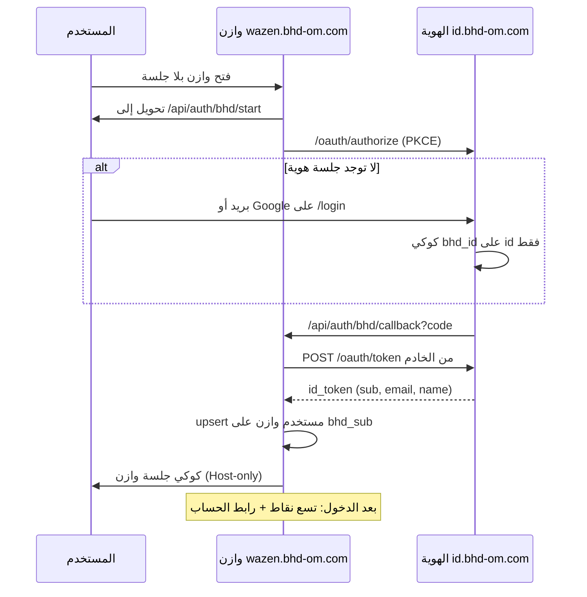

# خطة ربط وازن بهوية BHD ومشغّل التطبيقات

> **لمن:** مستودع [ainoamn/WAZEN](https://github.com/ainoamn/WAZEN)  
> **المصدر المعتمد:** هذا الملف في [ainoamn/ONE-BHD](https://github.com/ainoamn/ONE-BHD) — انسخه إلى `docs/BHD-WAZEN-INTEGRATION.md` داخل وازن  
> **التاريخ:** 19 أغسطس 2026  
> **المواصفات:** `bhd-identity.v1` + `bhd-appswitcher.v1`  
> **النطاق:** توحيد **تسجيل الدخول** و**شاشة التطبيقات** فقط

وازن يبقى مستقلاً: المحافظ، المصاريف، الرحلات، الجمعيات، الفواتير، الاشتراكات الداخلية، والصلاحيات **لا تُنقل ولا تُشارك**. لا تُنسخ جداول الهوية. لا تُستخدم قاعدة بيانات البوابة.

انسخ أيضاً بدون تعديل:

- [BHD-IDENTITY-SSO.md](https://github.com/ainoamn/ONE-BHD/blob/main/docs/BHD-IDENTITY-SSO.md) — نفّذ **القسم 6** حرفياً
- [BHD-APP-SWITCHER.md](https://github.com/ainoamn/ONE-BHD/blob/main/docs/BHD-APP-SWITCHER.md) — نفّذ بعد نجاح الدخول

---

## 0. عقد التنفيذ (لا تتجاوزه)

1. **لا تشارك** `DATABASE_URL` مع البوابة أو حسابي أو أي منتج.
2. **لا تضبط** `Domain=.bhd-om.com` على أي كوكي.
3. **لا تضمّن** الهوية في `iframe`. النقر ينتقل انتقالاً كاملاً.
4. **لا تضع** زر Google على واجهة وازن بعد الربط. جوجل على `id.bhd-om.com` فقط.
5. **لا تبنِ** تسجيل مستخدم نهائي جديد في وازن. التسجيل في الهوية.
6. **لا تنسخ** كلمات المرور ولا هاشاتها من وازن إلى الهوية أو العكس.
7. المعرّف المشترك الوحيد: JWT `sub` = `bhd_users.id` في الهوية = عمود `bhd_sub` في وازن.
8. لا تبدأ مشغّل التطبيقات قبل أن يعمل `GET /api/auth/bhd/start` بتحويل 302 إلى الهوية.

---

## 1. ماذا يُربط وكيف



بعد هذا الربط: من البوابة، اختيار وازن يفتح `https://wazen.bhd-om.com/api/auth/bhd/start?returnTo=/`. إن كانت جلسة الهوية قائمة لا تُطلب كلمة مرور مرة ثانية.

---

## 2. قيم مجمّدة لوازن — لا تغيّرها

| المفتاح | القيمة |
|---|---|
| `client_id` | `bhd-wazen` |
| Issuer | `https://id.bhd-om.com` |
| اكتشاف OIDC | `https://id.bhd-om.com/.well-known/openid-configuration` |
| الدخول | `https://id.bhd-om.com/login` |
| الحساب | `https://id.bhd-om.com/account` |
| الإنتاج | `https://wazen.bhd-om.com` |
| `redirect_uri` الإنتاج | `https://wazen.bhd-om.com/api/auth/bhd/callback` |
| `redirect_uri` محلي | `http://localhost:3000/api/auth/bhd/callback` و`http://localhost:3001/api/auth/bhd/callback` |
| `post_logout_redirect_uri` | `https://wazen.bhd-om.com/` |
| scopes | `openid profile email` |
| PKCE | `S256` إلزامي |
| DNS | `wazen` CNAME → `cname.vercel-dns.com` (ليس `vercel-dns-017`) |

`redirect_uri` يُقارَن مطابقة تامة. هذه القيم مسجّلة مسبقاً على الهوية.

---

## 3. المرحلة أ — الدخول الموحّد (القسم 6)

### 3.1 متغيرات بيئة وازن (خادم فقط)

```env
BHD_IDENTITY_ISSUER=https://id.bhd-om.com
BHD_OAUTH_CLIENT_ID=bhd-wazen
BHD_OAUTH_CLIENT_SECRET=
BHD_OAUTH_REDIRECT_URI=https://wazen.bhd-om.com/api/auth/bhd/callback
```

محلياً غيّر `BHD_OAUTH_REDIRECT_URI` إلى `http://localhost:3000/api/auth/bhd/callback`.

`AUTH_SECRET` (أو سر جلسة وازن الحالي) **يبقى مختلفاً** عن سر الهوية. يوقّع كوكي وازن فقط.

اطلب `BHD_OAUTH_CLIENT_SECRET` من مشغّل الهوية (متغير Vercel على `one-bhd`: `BHD_OAUTH_CLIENT_SECRET_WAZEN`). لا ترفعه إلى Git. إن كان عميل الطرف الأول يقبل PKCE بلا سر، أرسل `code_verifier` مع `client_id` من الخادم.

### 3.2 قاعدة وازن فقط

```sql
ALTER TABLE <users> ADD COLUMN bhd_sub UUID UNIQUE;
CREATE INDEX IF NOT EXISTS users_bhd_sub_idx ON <users>(bhd_sub);
```

لا تحذف أعمدة البريد أو جوجل المحلية قبل اكتمال الترحيل. لا تضف جداول `bhd_users`.

### 3.3 المساران الإلزاميان

| المسار في وازن | الوظيفة |
|---|---|
| `GET /api/auth/bhd/start` | يولّد PKCE ويحوّل إلى **الهوية** لا إلى أصل وازن |
| `GET /api/auth/bhd/callback` | يستبدل `code` بتوكن على **خادم** وازن ثم يصدر جلسة وازن |

**تحذير:** لا تنسخ مسار البوابة حرفياً. البوابة تحوّل إلى `{origin}/oauth/authorize` لأنها هي الهوية. وازن يجب أن يحوّل إلى:

```
https://id.bhd-om.com/oauth/authorize
  ?client_id=bhd-wazen
  &redirect_uri={BHD_OAUTH_REDIRECT_URI}
  &response_type=code
  &scope=openid%20profile%20email
  &state={state}
  &nonce={nonce}
  &code_challenge={challenge}
  &code_challenge_method=S256
```

واستبدال التوكن:

```
POST https://id.bhd-om.com/oauth/token
Content-Type: application/x-www-form-urlencoded

grant_type=authorization_code
&code=...
&redirect_uri=...
&client_id=bhd-wazen
&client_secret=...
&code_verifier=...
```

احفظ في كوكي `bhd_oauth_state` (5 دقائق، HttpOnly، Host-only، SameSite=Lax): `{ state, nonce, verifier, returnTo }`.

`returnTo` مسار نسبي آمن فقط (`/` أو `/dashboard`). ارفض URLs مطلقة.

### 3.4 التحقق من ID Token (على خادم وازن)

1. `iss` === `https://id.bhd-om.com`
2. `aud` === `bhd-wazen`
3. `exp` في المستقبل
4. `nonce` يطابق الكوكي
5. `email_verified === true` وإلا ارفض
6. استخدم `sub` كـ `bhd_sub`

### 3.5 ربط مستخدم وازن

```
إن وُجد صف bhd_sub = sub → حدّث الاسم/البريد/الهاتف/الصورة من التوكن
وإلا إن وُجد بريد موثّق مطابق → اكتب bhd_sub إن كان فارغاً
وإلا → أنشئ مستخدم وازن جديداً مرتبطاً بـ bhd_sub بلا كلمة مرور محلية
         والصلاحية الافتراضية الحالية لوازن (لا تُمنح أدوار من الهوية)
```

لا تطابق على بريد غير موثّق. لا تطابق على اسم المستخدم وحده. لا تستورد هاش كلمة المرور (وازن PBKDF2، الهوية bcrypt).

### 3.6 الخروج

1. امسح كوكي جلسة **وازن**.
2. حوّل إلى:

```
https://id.bhd-om.com/oauth/end-session
  ?client_id=bhd-wazen
  &post_logout_redirect_uri=https://wazen.bhd-om.com/
```

### 3.7 شاشة الدخول في وازن

بعد الإطلاق: `/login` في وازن غلاف يحوّل فوراً إلى `/api/auth/bhd/start`. أزل زر Google المحلي ومسار `/api/auth/google` بعد نجاح الاختبار.

---

## 4. المرحلة ب — شاشة التطبيقات (بعد نجاح أ)

انسخ من مجلد النشر `BHD-Complete-Brand-and-Portal-v1.1.0/` في ONE-BHD **كما هي**:

| من ONE-BHD | إلى وازن |
|---|---|
| `app/lib/bhd/apps.ts` | `lib/bhd/apps.ts` (أو المسار المكافئ) |
| `app/components/bhd/BhdAppSwitcher.tsx` | بجانب أيقونة المستخدم بعد الجلسة |
| `app/components/bhd/BhdAppIcon.tsx` | مع المشغّل |
| أنماط `.bhd-switcher-*` و`.bhd-app-icon` من `app/globals.css` | CSS وازن |

قواعد المشغّل:

- يظهر **فقط** بعد جلسة وازن صالحة.
- يسار الصورة في RTL.
- رابط «الحساب» = `https://id.bhd-om.com/account` (ليس صفحة وازن).
- الخروج يستدعي خروج وازن ثم `end-session` أعلاه.
- لا تُضف تطبيقاً محلياً إلى `apps.ts`. القائمة تُحدَّث في ONE-BHD ثم تُنسخ.

---

## 5. ما يفعله ONE-BHD بعد نجاح وازن (ليس عمل وازن)

عندما يرد `GET https://wazen.bhd-om.com/api/auth/bhd/start` بتحويل 302 إلى `id.bhd-om.com`:

1. في `lib/bhd/apps.ts` يُقلَب عنصر وازن من `mode: "browse"` إلى `mode: "sso"` (نُفِّذ في وازن 20 أغسطس 2026؛ يُزامَن الكتالوج في ONE-BHD).
2. يُعاد نسخ الملف إلى البوابة وباقي المواقع.

حتى ذلك الحين، النقر على وازن من البوابة يفتح الموقع فقط دون دخول تلقائي.

---

## 6. اختبار إلزامي قبل القطع

1. مستخدم جديد يسجّل على `id.bhd-om.com` بجوجل أو بريد → يدخل وازن دون نموذج ثانٍ → صف وازن فيه `bhd_sub` = `sub`.
2. نفس المستخدم من البوابة بعد قلب `mode` يفتح وازن داخلًا دون كلمة مرور إن جلسة الهوية قائمة.
3. مستخدم وازن قديم ببريد موثّق مطابق → لا يُنشأ صف ثانٍ.
4. `state` أو `nonce` خاطئ → رفض.
5. فتح وازن بعد الخروج يطلب دخولاً عبر الهوية.
6. من عُمان: `https://id.bhd-om.com` و`https://wazen.bhd-om.com` يفتحان (CNAME العام).
7. بلا جلسة وازن: لا أيقونة تسع نقاط.
8. بعد الدخول: التسع نقاط بجانب الصورة، «الحساب» يفتح `https://id.bhd-om.com/account`.
9. محافظ وازن لم تُمس. لا طلبات إلى `DATABASE_URL` الهوية من وازن.

---

## 7. تعريف «تم»

- [ ] `bhd_sub` على مستخدم وازن
- [ ] `/api/auth/bhd/start` يحوّل إلى `id.bhd-om.com`
- [ ] `/api/auth/bhd/callback` يصدر جلسة وازن
- [ ] الخروج يمسح وازن ثم `end-session`
- [ ] أُزيل زر Google من واجهة وازن
- [ ] المشغّل يظهر بعد الدخول فقط
- [ ] أُبلغ ONE-BHD لقلب `mode` إلى `"sso"`

---

## 8. رسالة لصق لوكيل وازن

```text
نفّذ docs/BHD-WAZEN-INTEGRATION.md كما هي.
المصدر: https://github.com/ainoamn/ONE-BHD/blob/main/docs/BHD-WAZEN-INTEGRATION.md
المواصفات: BHD-IDENTITY-SSO.md القسم 6، وBHD-APP-SWITCHER.md بعد نجاح الدخول.
النطاق: دخول موحّد + مشغّل تطبيقات فقط.
لا تشارك DATABASE_URL. لا Domain=.bhd-om.com. لا iframe. لا زر Google على وازن.
client_id=bhd-wazen
Issuer=https://id.bhd-om.com
redirect_uri=https://wazen.bhd-om.com/api/auth/bhd/callback
حوّل authorize وtoken إلى الهوية لا إلى أصل وازن.
بعد النجاح أبلغ ONE-BHD لقلب mode وازن إلى sso.
```
